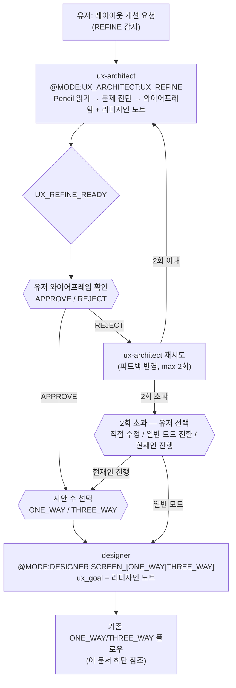
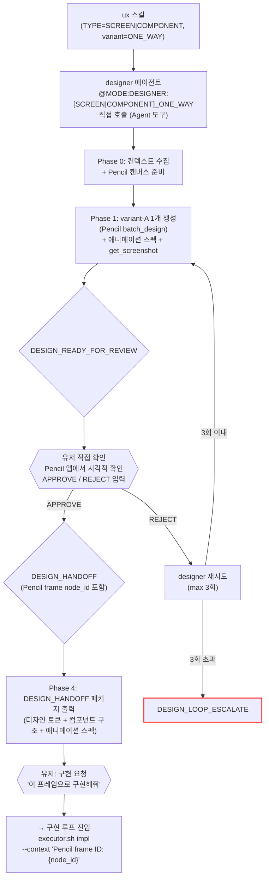
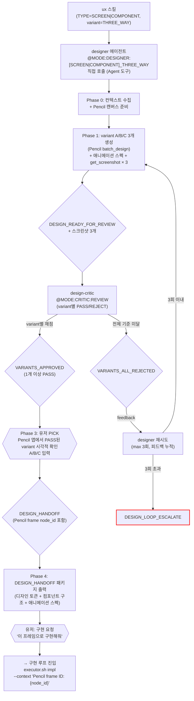

# 디자인 루프 (Design) — v4 2×2 포맷 매트릭스

진입 조건: 유저 UX 변경 요청 → ux 스킬 → designer 에이전트 직접 호출
**harness/executor.sh design 경유 없음. designer는 하네스 루프 밖.**

> **오케스트레이션 주체**: `ux` 스킬(commands/ux.md)이 담당한다.
> `harness/design.sh`는 deprecated — 레거시 참조용으로만 보존. 신규 작업에서 사용 금지.
> ONE_WAY: 스킬이 designer 직접 호출 후 유저 확인.
> THREE_WAY: 스킬이 designer → design-critic 루프(max 3회)를 순차 오케스트레이션.

> **참고**: [설계 루프](system-design.md)에서도 designer를 호출하지만, 그 경로는 plan loop 경유(기획-UX 루프 후)이며 이 문서의 ux 스킬 독립 경로와 별개다. 설계 루프에서의 designer 파라미터(`skip_issue_creation`, `save_handoff_to`)는 [system-design.md](system-design.md) 참조.

---

## REFINE Flow (화면 레이아웃 리디자인)

기능/플로우 변경 없이 기존 화면의 레이아웃·비주얼을 개편할 때 사용.
**화면 단위만 지원** (컴포넌트 단독 → 기존 COMPONENT 모드 직접).

**핵심 차이점 (일반 디자인 vs REFINE):**
- ux-architect가 **Pencil 읽기**(batch_get, get_screenshot)로 현재 디자인을 직접 분석
- designer에게 유저 피드백이 아닌 **구조화된 리디자인 노트**(와이어프레임 + 컴포넌트별 지침)를 전달
- 유저가 와이어프레임을 먼저 승인한 후 designer 진입 — 이중 확인으로 방향 잘못 잡는 것 방지

---

## 2×2 포맷 매트릭스

| | ONE_WAY (1개) | THREE_WAY (3개) |
|---|---|---|
| **SCREEN** (전체 화면) | `SCREEN_ONE_WAY` | `SCREEN_THREE_WAY` |
| **COMPONENT** (개별 컴포넌트) | `COMPONENT_ONE_WAY` | `COMPONENT_THREE_WAY` |

| 모드 | 진입 @MODE | 크리틱 |
|---|---|---|
| **SCREEN_ONE_WAY** | `@MODE:DESIGNER:SCREEN_ONE_WAY` | 없음 — 유저 직접 확인 |
| **SCREEN_THREE_WAY** | `@MODE:DESIGNER:SCREEN_THREE_WAY` | design-critic PASS/REJECT → 유저 PICK |
| **COMPONENT_ONE_WAY** | `@MODE:DESIGNER:COMPONENT_ONE_WAY` | 없음 — 유저 직접 확인 |
| **COMPONENT_THREE_WAY** | `@MODE:DESIGNER:COMPONENT_THREE_WAY` | design-critic PASS/REJECT → 유저 PICK |

---

## ONE_WAY 모드 흐름 (SCREEN_ONE_WAY / COMPONENT_ONE_WAY)

---

## THREE_WAY 모드 흐름 (SCREEN_THREE_WAY / COMPONENT_THREE_WAY)

---

## 마커 레퍼런스

### 인풋 마커 (designer에게 전달하는 @MODE)

| @MODE | 대상 에이전트 | 호출 시점 |
|---|---|---|
| `@MODE:DESIGNER:SCREEN_ONE_WAY` | designer | SCREEN 전체 화면 + 1 variant |
| `@MODE:DESIGNER:SCREEN_THREE_WAY` | designer | SCREEN 전체 화면 + 3 variants |
| `@MODE:DESIGNER:COMPONENT_ONE_WAY` | designer | COMPONENT 단독 + 1 variant |
| `@MODE:DESIGNER:COMPONENT_THREE_WAY` | designer | COMPONENT 단독 + 3 variants |
| `@MODE:CRITIC:REVIEW` | design-critic | THREE_WAY 모드 — 3 variant PASS/REJECT 심사 |
| `@MODE:CRITIC:UX_SHORTLIST` | design-critic | SCREEN_THREE_WAY 심층 모드 — 스케치 5→3 선별 |

### 아웃풋 마커 (이 루프에서 발생하는 시그널)

| 마커 | 발행 주체 | 다음 행동 |
|------|-----------|-----------|
| `UX_REFINE_READY` | ux-architect (UX_REFINE) | 유저 와이어프레임 승인 → designer SCREEN 모드 호출 |
| `DESIGN_READY_FOR_REVIEW` | designer | ONE_WAY: 유저 직접 확인 / THREE_WAY: design-critic 호출 |
| `VARIANTS_APPROVED` | design-critic (THREE_WAY) | 1개 이상 PASS — Phase 3 유저 PICK 안내 |
| `VARIANTS_ALL_REJECTED` | design-critic (THREE_WAY) | 전체 REJECT — designer 재시도 (max 3회, 피드백 누적) |
| `UX_REDESIGN_SHORTLIST` | design-critic | SCREEN_THREE_WAY 심층 모드 — 3개 선별 → Phase 1 variant 생성 |
| `DESIGN_LOOP_ESCALATE` | designer (3회 초과) | 유저 직접 선택 |
| `DESIGN_HANDOFF` | designer Phase 4 (유저 선택 후) | Pencil frame node_id 전달 → 유저 구현 요청 시 executor.sh impl |

---

## 핵심 아키텍처 원칙

- **designer는 하네스 루프 밖**: 결과물이 Pencil 캔버스(파일 변경 없음, git 없음)
- **유저 확인은 Pencil 앱**: 터미널 APPROVE/REJECT 대신 시각적 확인
- **ux 스킬이 designer 직접 호출**: harness/executor.sh design 경유 없음
- **구현 연결**: 확정된 Pencil 프레임 node_id → engineer에게 전달 → batch_get으로 읽어 src/ 구현

---

## 의존성

- **Pencil.dev** 설치 필요 (VS Code 확장 또는 데스크톱 앱)
- **Pencil MCP 서버** 활성화 필요
- 사용 MCP 도구: `batch_design`, `batch_get`, `get_screenshot`, `get_editor_state`
