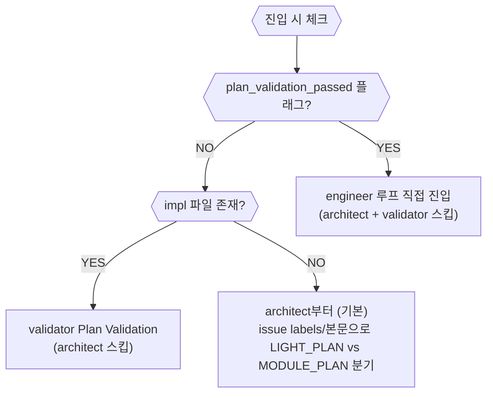

# 구현 루프 개요 (Impl)

진입 조건: `READY_FOR_IMPL` 또는 `plan_validation_passed`

---

## depth 선택 기준

depth는 architect가 impl 파일 frontmatter `depth:` 필드로 선언한다.
태그(`(MANUAL)`/`(BROWSER:DOM)`)를 grep해서 판단하는 방식은 폐기됨.

| depth | 기준 | 상세 문서 |
|---|---|---|
| `simple` | behavior 불변 — 이름·텍스트·스타일·설정값·번역 (파일 수 무관) | [impl_simple.md](impl_simple.md) |
| `std` | behavior 변경 — 로직·API·DB·컴포넌트 동작 (기본값) | [impl_std.md](impl_std.md) |
| `deep` | behavior 변경 + 보안 민감 — auth·결제·암호화·토큰·외부 보안 API | [impl_deep.md](impl_deep.md) |

### 자동 선택 규칙 (`--depth` 미지정 시)

impl 파일의 YAML frontmatter에서 `depth:` 필드를 읽는다:
- `depth: simple` → `simple`
- `depth: std` → `std`
- `depth: deep` → `deep`
- frontmatter 없음 또는 유효하지 않은 값 → `std` (기본값)

---

## QA / DESIGN_HANDOFF 진입 흐름 (기존 direct 대체)

impl 파일 없이 issue 번호만으로 진입하는 경우:

```
qa 스킬 → QA 에이전트 (이슈 생성 #N)
→ executor.sh impl --issue <N>  (--impl 없이)
→ impl.sh: impl 파일 없음 감지
  → pre-analysis (suspected_files: issue 키워드 grep 상위 10개, issue_summary, labels)
  → architect LIGHT_PLAN (suspected_files + issue_summary + labels 전달)
    → impl 파일 생성 (frontmatter depth: simple|std|deep 선언)
  → plan_validation
  → simple / std / deep 루프
```

ux 스킬 DESIGN_HANDOFF도 동일한 흐름:
```
ux 스킬 → designer → DESIGN_HANDOFF → GitHub 이슈 생성 (#N)
→ 유저 확인
→ design_critic_passed 플래그 생성
→ design_handoff.md 파일 저장 (.claude/harness-state/.flags/{prefix}_design_handoff.md)
→ 이슈 본문에 DESIGN_HANDOFF append
→ executor.py impl --issue <N>
```

### DESIGN_HANDOFF 자동 주입 (impl_router.py)

`impl_router.py`가 LIGHT_PLAN 분기 진입 시 **자동으로** 핸드오프 파일을 감지해 architect 프롬프트에 주입한다.
메인 Claude가 `--context`를 빠뜨려도 코드 레벨에서 보장된다.

| 조건 | 동작 |
|---|---|
| `design_critic_passed` 플래그 O + `{prefix}_design_handoff.md` O | architect 프롬프트에 `## DESIGN_HANDOFF` 섹션 자동 추가 |
| `design_critic_passed` 플래그 O + `{prefix}_design_handoff.md` X | 경고 로그 출력 (`⚠️ design_handoff.md 없음`) |
| `design_critic_passed` 플래그 X | 아무것도 안 함 (일반 bug/feat 경로) |

---

## 재진입 상태 감지

구현 루프 재진입 시 이전 실행의 완료 단계를 감지해 스킵한다.



---

## impl 파일 Design Ref 섹션

architect가 impl 파일 작성 시 DESIGN_HANDOFF가 프롬프트에 포함되어 있으면, impl 파일에 `## Design Ref` 섹션을 포함한다:

```markdown
## Design Ref
- **Pencil Frame ID**: [node_id]
- **Design Tokens**: [주요 토큰 요약 — 색상, 서체 등]
- **Component Structure**: [컴포넌트 트리 요약]
- **Animation Spec**: [애니메이션 요약]
```

DESIGN_HANDOFF 주입 경로:
- **MODULE_PLAN**: `docs/design-handoff.md` 파일 존재 시 architect 프롬프트에 경로 전달
- **LIGHT_PLAN**: `.claude/harness-state/.flags/{prefix}_design_handoff.md` 파일 존재 시 architect 프롬프트에 내용 자동 주입

engineer는 이 섹션을 참조해 `batch_get`으로 Pencil 프레임을 직접 읽고 구현한다.

---

## 호출 형식

```bash
bash ~/.claude/harness/executor.sh impl \
  --impl <impl_file_path> \
  --issue <issue_number> \
  [--prefix <prefix>] \
  [--depth simple|std|deep]

# impl 파일 없이 (QA/DESIGN_HANDOFF): architect가 LIGHT_PLAN으로 impl 생성
bash ~/.claude/harness/executor.sh impl --issue <N> [--prefix <P>]
```

---

## harness.config.json 설정 가이드

프로젝트 루트의 `.claude/harness.config.json`에서 하네스 동작을 커스텀한다.

```jsonc
{
  // 필수
  "prefix": "mb",                    // 프로젝트 식별자 (플래그/로그 네이밍)

  // 테스트/린트 (빈 문자열이면 해당 단계 스킵)
  "test_command": "npx vitest run",  // depth=std/deep에서 ground-truth 테스트 실행
  "lint_command": "npx eslint . --max-warnings 0", // automated_checks + POLISH regression
  "build_command": "npx tsc --noEmit", // automated_checks + POLISH regression (빌드/타입체크)

  // 비용 제어
  "max_total_cost": 20.0,            // 전체 루프 USD 상한 (초과 시 HARNESS_BUDGET_EXCEEDED)
  "token_budget": {                   // 도메인별 토큰 예산 (85% 경고)
    "frontend": 180000,
    "backend": 280000,
    "default": 250000
  },

  // 격리
  "isolation": "",                    // "" (없음) 또는 "worktree" (agent_call에 isolation 옵션)

  // Second Reviewer — 외부 AI 병렬 리뷰
  "second_reviewer": "gemini",        // "gemini", "gpt", "" (비활성)
  "second_reviewer_model": "gemini-2.5-flash"  // 모델 지정 (빈 문자열이면 기본값)
}
```

### Second Reviewer 설정

pr-reviewer(Claude)와 동시에 외부 AI를 비동기로 병렬 실행.

| 설정 | 값 | 동작 |
|------|-----|------|
| `"second_reviewer": ""` | 비활성 (기본값) | 기존 동작 그대로 |
| `"second_reviewer": "gemini"` | Gemini CLI | `gemini -m {model} {diff}` 실행 |
| `"second_reviewer": "gpt"` | OpenAI CLI | `gpt -m {model} {diff}` 실행 |

**폴백**: CLI 미설치 / 타임아웃(120초) / 인증 에러 → 조용히 스킵. 하네스 루프 영향 0.
**결과 합산**: LGTM 시 findings → POLISH 항목에 append. CHANGES_REQUESTED 시 무시.
