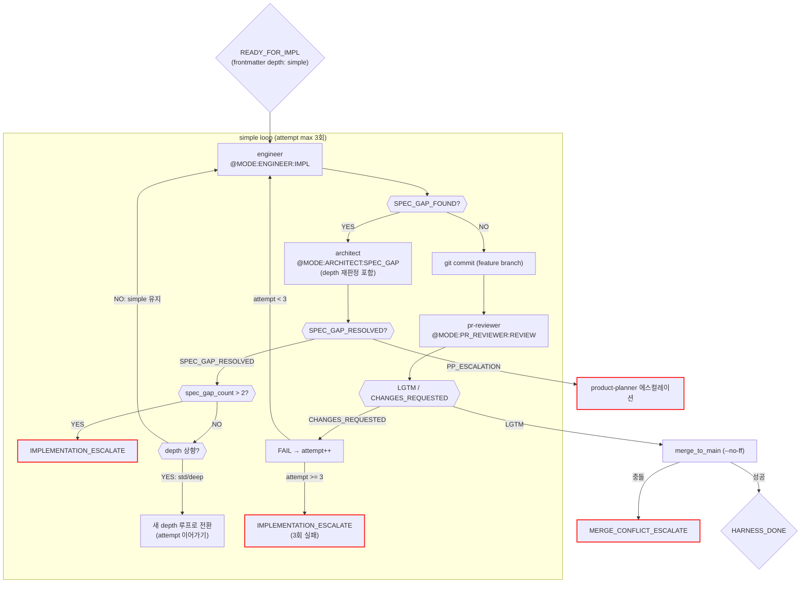

# Simple 구현 루프 (impl_simple)

진입 조건: impl frontmatter `depth: simple` — behavior 불변 변경 (이름·텍스트·스타일·설정값·번역)
스크립트: `harness/impl_simple.sh`

---

## 특징

- **LLM 호출**: 2회 (engineer + pr-reviewer)
- **테스트·검증·보안 스킵**: test-engineer, vitest, validator, security-reviewer 없음
- **머지 조건**: `pr_reviewer_lgtm`
- **사용 사례**: behavior 불변 변경 — 파일 수 무관, 로직 변경 없음
- **SPEC_GAP**: architect 재판정으로 depth 상향 가능 (simple→std→deep 단방향)

---

## 흐름

---

## SPEC_GAP depth 재판정

SPEC_GAP_FOUND 발생 시 architect는 갭을 해결하면서 depth를 재판정한다.
재판정된 depth가 simple보다 높으면 (std 또는 deep), 현재 attempt를 이어가며 새 depth 스크립트로 전환한다.

- **단방향**: simple → std → deep (하향 없음)
- **attempt 이어가기**: simple에서 1회 소비 후 std로 전환 시 남은 2회 사용
- **전환 메커니즘**: `exec bash impl_${new_depth}.sh ...` (프로세스 교체)

---

## 실패 유형별 수정 전략

| fail_type | 컨텍스트 (engineer에게 전달) | 지시 |
|---|---|---|
| `autocheck_fail` | automated_checks 실패 내용 | "사전 검사 실패. 위 문제를 해결한 뒤 다시 구현하라." |
| `pr_fail` | MUST FIX 항목 목록 | "코드 품질 이슈. MUST FIX 항목만 수정. 기능 변경 금지." |

---

## 마커 레퍼런스

### 인풋 마커

| @MODE | 대상 에이전트 | 호출 시점 |
|---|---|---|
| `@MODE:ENGINEER:IMPL` | engineer | 코드 구현 |
| `@MODE:PR_REVIEWER:REVIEW` | pr-reviewer | engineer 커밋 후 |
| `@MODE:ARCHITECT:SPEC_GAP` | architect | SPEC_GAP_FOUND 수신 시 (depth 재판정 포함) |

### 아웃풋 마커

| 마커 | 발행 주체 | 다음 행동 |
|------|-----------|-----------|
| `SPEC_GAP_FOUND` | engineer | architect SPEC_GAP → depth 재판정 |
| `SPEC_GAP_RESOLVED` | architect | depth 확인 → engineer 재시도 또는 루프 전환 |
| `LGTM` | pr-reviewer | merge |
| `CHANGES_REQUESTED` | pr-reviewer | engineer 재시도 (attempt++) |
| `HARNESS_DONE` | harness (merge 성공) | stories.md 체크 → 유저 보고 |
| `IMPLEMENTATION_ESCALATE` | harness (3회 실패 or SPEC_GAP 초과) | 메인 Claude 보고 |
| `MERGE_CONFLICT_ESCALATE` | harness (merge 충돌) | 메인 Claude 보고 |
