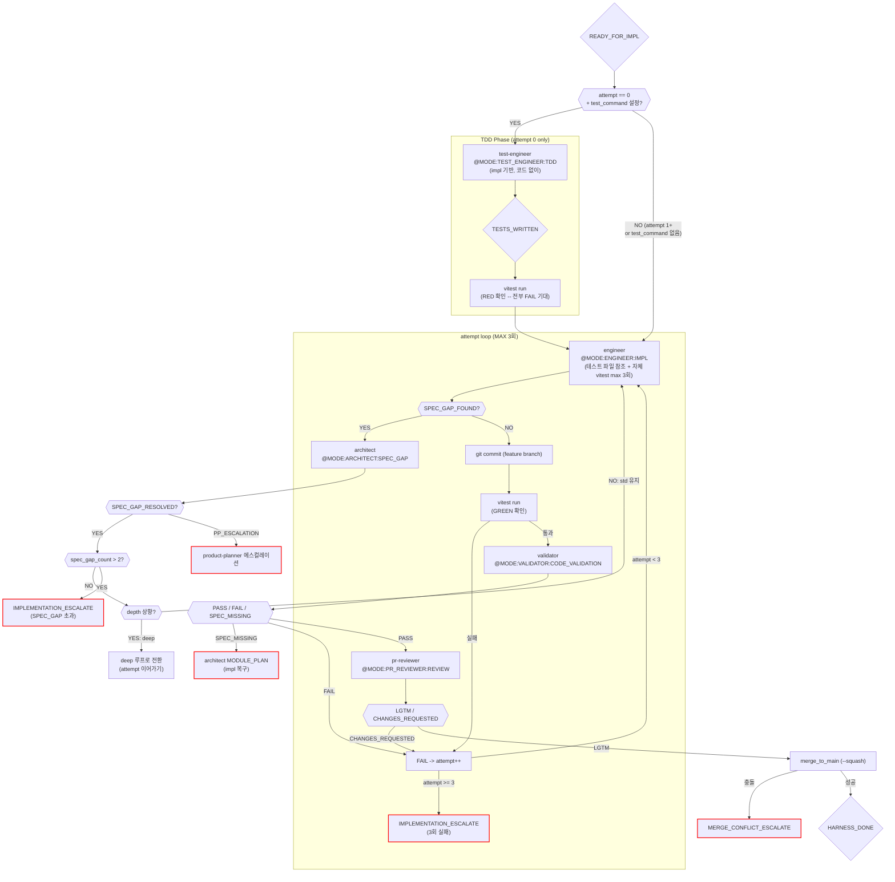

# Standard 구현 루프 (impl_std)

진입 조건: impl frontmatter `depth: std` -- behavior 변경 (기본값)

---

## 특징

- **TDD 순서**: test-engineer(TDD) -> engineer (attempt 0)
- **LLM 호출**: 4회 (test-engineer + engineer + validator + pr-reviewer)
- **테스트**: test-engineer 선작성 + engineer 자체 vitest + harness GREEN 확인
- **보안**: security-reviewer 없음 (deep에서만)
- **머지 조건**: `pr_reviewer_lgtm`
- **test_command 미설정**: TDD 스킵, 기존 순서 폴백 (engineer -> test-engineer)

---

## 흐름

---

## attempt 0 vs 1+ 분기

| | attempt 0 (TDD) | attempt 1+ |
|---|---|---|
| test-engineer | TDD 모드 호출 (테스트 선작성) | 스킵 (테스트 이미 존재) |
| RED 확인 | vitest 실행, 전부 FAIL 기대 | 없음 |
| engineer 프롬프트 | impl + 테스트 파일 경로 포함 | impl + 이전 실패 내용 |
| engineer 자체 vitest | commit 전 max 3회 | commit 전 max 3회 |

---

## test_command 미설정 시 폴백

test_command가 빈 문자열이면 TDD 불가 (vitest 실행 자체가 안 됨).
기존 순서 유지: engineer -> commit -> test-engineer(기존 방식) -> vitest.

---

## 실패 유형별 수정 전략

| fail_type | 컨텍스트 (engineer에게 전달) | 지시 |
|---|---|---|
| `autocheck_fail` | automated_checks 실패 내용 | "사전 검사 실패. 위 문제를 해결한 뒤 다시 구현하라." |
| `test_fail` | vitest 출력 전체 + 실패 테스트 파일 소스 | "테스트 실패. 구현 코드를 수정. 테스트 자체 수정 금지." |
| `validator_fail` | validator 리포트 + impl 파일 | "스펙 불일치. impl의 해당 항목 재확인 후 누락 구현." |
| `pr_fail` | MUST FIX 항목 목록 | "코드 품질 이슈. MUST FIX 항목만 수정. 기능 변경 금지." |

---

## 마커 레퍼런스

### 인풋 마커

| @MODE | 대상 에이전트 | 호출 시점 |
|---|---|---|
| `@MODE:TEST_ENGINEER:TDD` | test-engineer | attempt 0 (테스트 선작성) |
| `@MODE:ENGINEER:IMPL` | engineer | 코드 구현 (초회 + 재시도) |
| `@MODE:VALIDATOR:CODE_VALIDATION` | validator | vitest GREEN 후 |
| `@MODE:PR_REVIEWER:REVIEW` | pr-reviewer | validator PASS 후 |
| `@MODE:ARCHITECT:SPEC_GAP` | architect | SPEC_GAP_FOUND 수신 시 |

### 아웃풋 마커

| 마커 | 발행 주체 | 다음 행동 |
|------|-----------|-----------|
| `TESTS_WRITTEN` | test-engineer (TDD) | RED 확인 -> engineer |
| `SPEC_GAP_FOUND` | engineer | architect SPEC_GAP -> attempt 동결 |
| `SPEC_GAP_RESOLVED` | architect | engineer 재시도 |
| `PASS` | validator | pr-reviewer |
| `FAIL` | validator | engineer 재시도 |
| `SPEC_MISSING` | validator | architect MODULE_PLAN |
| `LGTM` | pr-reviewer | merge |
| `CHANGES_REQUESTED` | pr-reviewer | engineer 재시도 |
| `HARNESS_DONE` | harness (merge 성공) | stories.md 체크 -> 유저 보고 |
| `IMPLEMENTATION_ESCALATE` | harness (3회 실패) | 메인 Claude 보고 |
| `MERGE_CONFLICT_ESCALATE` | harness (merge 충돌) | 메인 Claude 보고 |
