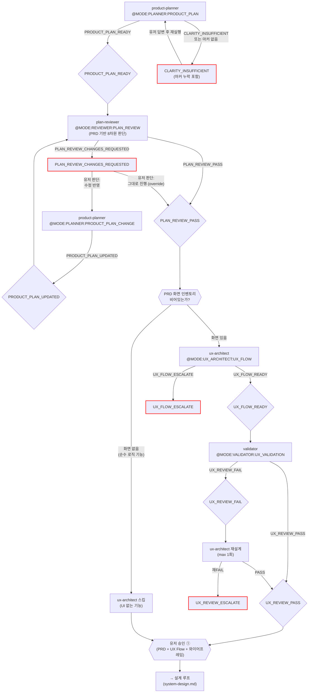

# 기획-UX 루프 (Plan)

진입 조건: 신규 프로젝트 / PRD 변경
종료 게이트: **유저 승인 ①** (PRD + UX Flow + 와이어프레임)

> 이 루프가 끝나면 → [설계 루프](system-design.md)로 진행

---

---

## UI 없는 기능 감지

planner PRD의 화면 인벤토리가 비어있거나 모든 기능에 `(UI 없음)` 표시 → ux-architect 스킵, 설계 루프 직행.

## UX_SYNC 모드 분기

src/ 코드 존재 + ux-flow.md 없음 → `@MODE:UX_ARCHITECT:UX_SYNC` 모드로 호출 (기존 프로젝트 현행화).

## 유저 승인 ① 라우팅

유저 수정 요청 시 메인 Claude가 판단:
- **화면 추가/삭제** → planner(PRODUCT_PLAN_CHANGE) + ux-architect(UX_FLOW) 재실행
- **기존 화면 내 변경** → ux-architect(UX_FLOW)만 재실행
- **비기능 변경** → planner(PRODUCT_PLAN_CHANGE)만 재실행

## plan-reviewer 판단 게이트

**위치**: product-planner 직후, ux-architect 직전.
**근거**: PRD-level 문제(현실성·MVP 과적재·경쟁 맥락·과금 설계·기술 실현성 등)를 UX Flow 생성 전에 걸러서 ux-architect의 대규모 재작업 비용을 방지. UX 저니 자연스러움 차원은 PRD의 "화면 인벤토리 + 대략적 플로우" 섹션으로 고수준 판정이 가능하고, 상세 UX 형식·완결성 체크는 이후 validator(UX)가 전담.

### 게이트 동작
- `PLAN_REVIEW_PASS` → ux-architect 호출 진행
- `PLAN_REVIEW_CHANGES_REQUESTED` → 하네스 루프 종료. 메인 Claude가 리포트 **원문 그대로** 유저에게 전달 → 유저 결정:
  - "수정 반영" → planner(PRODUCT_PLAN_CHANGE) 재호출 (체크포인트 리셋 규칙 동일 적용 — 이 시점엔 아직 ux_flow_doc 미생성이라 `prd_path`만 관리)
  - "그대로 진행 (override)" → 스킬이 `{prefix}_plan_review_override` 1회성 플래그 기록 후 plan 루프 재실행 → reviewer 스킵 → ux-architect로 진행
  - "취소" → 종료

**중요**: plan-reviewer는 기획 본문을 수정하지 않는다. 제안 방향만 1~2줄로 제시. 실제 수정은 product-planner/ux-architect가 담당. 상세 UX 형식 체크(화면 커버리지·상태 정의·수용 기준)는 validator(UX)가 계속 전담.

## 체크포인트

| 산출물 | 존재 시 스킵 |
|--------|-------------|
| `prd.md` | product-planner 스킵 |
| `docs/ux-flow.md` | ux-architect 스킵 |

상태는 `{prefix}_plan_metadata.json`에 저장.

---

## 마커 레퍼런스

### 인풋 마커

| @MODE | 대상 에이전트 | 호출 시점 |
|---|---|---|
| `@MODE:PLANNER:PRODUCT_PLAN` | product-planner | 신규 기획 시작 |
| `@MODE:PLANNER:PRODUCT_PLAN_CHANGE` | product-planner | 기존 PRD 변경 |
| `@MODE:UX_ARCHITECT:UX_FLOW` | ux-architect | PRODUCT_PLAN_READY 후 UX 설계 |
| `@MODE:UX_ARCHITECT:UX_SYNC` | ux-architect | 기존 프로젝트 현행화 |
| `@MODE:REVIEWER:PLAN_REVIEW` | plan-reviewer | PRODUCT_PLAN_READY 직후 — ux-architect 호출 전 PRD 기반 판단 게이트 |
| `@MODE:VALIDATOR:UX_VALIDATION` | validator | UX_FLOW_READY 후 UX 형식 검증 |

### 아웃풋 마커

| 마커 | 발행 주체 | 다음 행동 |
|------|-----------|-----------|
| `PRODUCT_PLAN_READY` | product-planner | UI 여부 판단 → ux-architect 호출 or 스킵 |
| `PRODUCT_PLAN_UPDATED` | product-planner | 메인 Claude 범위 판단 → 라우팅 |
| `CLARITY_INSUFFICIENT` | product-planner | 유저에게 부족 항목 질문 → 답변 후 재실행 |
| `UX_FLOW_READY` | ux-architect | validator UX Validation |
| `UX_FLOW_ESCALATE` | ux-architect | 메인 Claude 보고 — planner 재호출 또는 유저 판단 |
| `PLAN_REVIEW_PASS` | plan-reviewer | ux-architect 호출 진행 |
| `PLAN_REVIEW_CHANGES_REQUESTED` | plan-reviewer | 메인 Claude 보고 — 유저 결정(수정 반영 / 그대로 진행 / 취소). UX Flow 생성 전이라 재작업 비용 최소 |
| `UX_REVIEW_PASS` | validator | 유저 승인 ① 게이트 |
| `UX_REVIEW_FAIL` | validator | ux-architect 재설계 (max 1회) |
| `UX_REVIEW_ESCALATE` | validator | 메인 Claude 보고 후 대기 |
