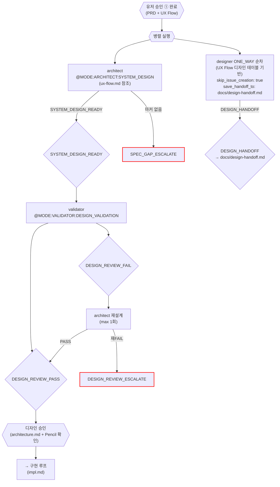

# 설계 루프 (System Design)

진입 조건: 유저 승인 ① 완료 + **planner ISSUE_SYNC 완료** (stories.md ↔ GitHub 이슈 동기화)
종료 게이트: **디자인 승인** (architecture.md + design-handoff.md 확정)

> 이전: [기획-UX 루프](plan.md) → 유저 승인 ① → planner ISSUE_SYNC
> 다음: [구현 루프](impl.md)

**오케스트레이션 주체**: 메인 Claude (하네스 자동이 아닌 메인 Claude가 직접 병렬 호출)

> **Note**: 설계 루프 진입 전에 planner `@MODE:PLANNER:ISSUE_SYNC`가 반드시 실행되어야 한다. stories.md의 스토리별 GitHub 이슈가 생성되고 `관련 이슈: #NNN`이 할당된 상태에서 architect/engineer가 작업.

---



---

## 병렬 실행 상세

### architect(SD) — 하네스 경유

`executor.py` 경유 (기존 패턴). ux-flow.md를 참조해서 화면 구조 기반 시스템 설계.

```
@MODE:ARCHITECT:SYSTEM_DESIGN
@PARAMS: { "plan_doc": "prd.md", "ux_flow_doc": "docs/ux-flow.md" }
```

### designer — Agent 도구 직접 호출 (하네스 밖)

UX Flow Doc의 **디자인 테이블**에서 대상 화면을 추출 → 화면별 ONE_WAY 순차 호출.
상세 designer 동작은 [디자인 루프](design.md) 참조.

추가 파라미터:
- `skip_issue_creation: true` — Phase 0-0 (GitHub 이슈 생성) 스킵
- `save_handoff_to: docs/design-handoff.md` — DESIGN_HANDOFF를 파일로 저장

```
@MODE:DESIGNER:SCREEN_ONE_WAY
@PARAMS: {
  "target": "[디자인 테이블 화면명]",
  "ux_goal": "[UX Flow Doc 인터랙션/와이어프레임 기반]",
  "skip_issue_creation": true,
  "save_handoff_to": "docs/design-handoff.md"
}
```

### 한쪽 실패 시

- architect 실패 + designer 성공 → architect만 재시도, design-handoff.md 보존
- architect 성공 + designer 실패 → designer만 재시도, architecture.md 보존
- 양쪽 실패 → 메인 Claude 보고

---

## UI 없는 기능 (ux-architect 스킵)

기획-UX 루프에서 ux-architect를 스킵한 경우:
- designer 호출 없음 (디자인 테이블이 비어있으므로)
- architect(SD)만 실행 → validator(DV) → 디자인 승인 (Pencil 확인 없이 architecture.md만 검토)

---

## 체크포인트

| 산출물 | 존재 시 스킵 |
|--------|-------------|
| `docs/architecture.md` | architect(SD) 스킵 |
| `docs/design-handoff.md` | designer 스킵 |

---

## 마커 레퍼런스

### 인풋 마커

| @MODE | 대상 에이전트 | 호출 시점 |
|---|---|---|
| `@MODE:ARCHITECT:SYSTEM_DESIGN` | architect | 유저 승인 ① 후 시스템 설계 (ux-flow.md 참조) |
| `@MODE:DESIGNER:SCREEN_ONE_WAY` | designer | 디자인 테이블 기반 화면별 순차 호출 |
| `@MODE:VALIDATOR:DESIGN_VALIDATION` | validator | SYSTEM_DESIGN_READY 후 설계 검증 |

### 아웃풋 마커

| 마커 | 발행 주체 | 다음 행동 |
|------|-----------|-----------|
| `SYSTEM_DESIGN_READY` | architect | validator Design Validation |
| `SPEC_GAP_ESCALATE` | plan_loop (architect 마커 누락 시 자동) | 메인 Claude 보고 후 대기 |
| `DESIGN_HANDOFF` | designer | docs/design-handoff.md에 저장 |
| `DESIGN_REVIEW_PASS` | validator | 디자인 승인 게이트 |
| `DESIGN_REVIEW_FAIL` | validator | architect 재설계 (max 1회) |
| `DESIGN_REVIEW_ESCALATE` | validator | 메인 Claude 보고 후 대기 |
