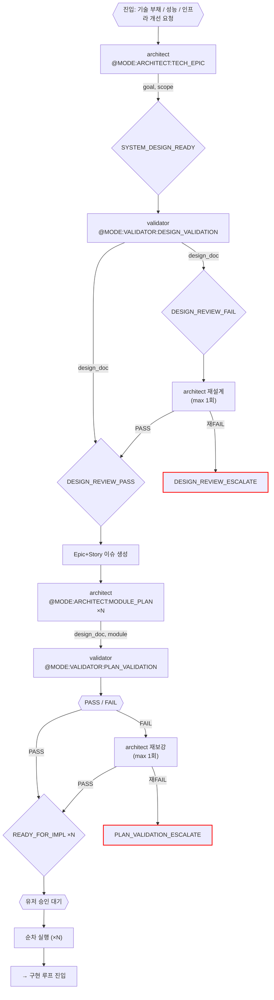

# 기술 에픽 루프 (Tech Epic)

진입 조건: 기술 에픽 / 리팩 / 인프라

---

---

## 순차 실행 실패 정책

| 상황 | 완료 모듈 | 실패 모듈 | 미실행 모듈 |
|------|-----------|-----------|-------------|
| IMPL_ESCALATE 발생 | 커밋 보존 (feature branch) | 변경분 보존 | 대기 |
| 유저: 재시도 | 유지 | 재실행 | 이후 순차 재개 |
| 유저: 스킵 | 유지 | revert | 이후 순차 재개 |
| 유저: 전체 중단 | branch 보존, main 머지 안 함 | — | — |

---

## 마커 레퍼런스

### 인풋 마커 (이 루프에서 호출하는 @MODE)

| @MODE | 대상 에이전트 | 호출 시점 |
|---|---|---|
| `@MODE:ARCHITECT:TECH_EPIC` | architect | 기술 에픽 설계 시작 |
| `@MODE:VALIDATOR:DESIGN_VALIDATION` | validator | SYSTEM_DESIGN_READY 후 설계 검증 |
| `@MODE:ARCHITECT:MODULE_PLAN` | architect | DESIGN_REVIEW_PASS 후 모듈별 impl 작성 ×N |
| `@MODE:VALIDATOR:PLAN_VALIDATION` | validator | MODULE_PLAN 완료 후 각 모듈별 검증 |

### 아웃풋 마커 (이 루프에서 발생하는 시그널)

| 마커 | 발행 주체 | 다음 행동 |
|------|-----------|-----------|
| `SYSTEM_DESIGN_READY` | architect | validator Design Validation |
| `DESIGN_REVIEW_PASS` | validator | Epic+Story 이슈 생성 → Module Plan ×N |
| `DESIGN_REVIEW_FAIL` | validator | architect 재설계 (max 1회) |
| `DESIGN_REVIEW_ESCALATE` | validator | 메인 Claude 보고 후 대기 |
| `PLAN_VALIDATION_PASS` | validator | 유저 승인 → 구현 루프 진입 |
| `PLAN_VALIDATION_FAIL` | validator | architect 재보강 (max 1회) |
| `PLAN_VALIDATION_ESCALATE` | validator | 메인 Claude 보고 후 대기 |
| `READY_FOR_IMPL` | architect | 유저 승인 → 구현 루프 진입 (순차 ×N) |
